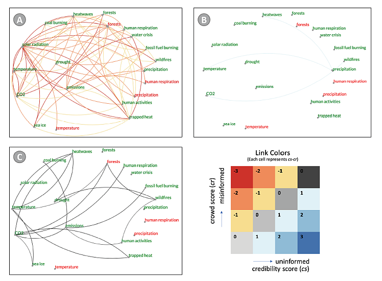

Belief Miner is a crowdsourcing tool designed to facilitate the collection and analysis of user-generated data on causal beliefs and cognitive illusions. The tool helps researchers systematically explore patterns and biases in human reasoning, allowing for deeper insights into how people perceive causality across various contexts.

## Key Features
- **Crowdsourced Data Collection**: Gather data from diverse participants to understand causal reasoning.
- **Interactive Interfaces**: Engage users with a user-friendly interface to capture nuanced beliefs.
- **Cognitive Bias Analysis**: Identify and analyze common cognitive biases and causal illusions.
- **Data Visualization**: Visualize causal belief data to reveal insights and trends.
- **Customizable Surveys**: Design and deploy tailored surveys for specific research needs.

## Usage
1. **Create a Survey**: Define the causal scenarios and questions to gather user input.
2. **Deploy to Participants**: Share the survey link to collect responses from a diverse audience.
3. **Analyze Results**: Use built-in analytics to identify patterns, biases, and correlations.
4. **Visualize Insights**: Generate visual representations of causal belief data for reporting and publication.

## Technologies Used
- **Frontend**: D3.js and React for interactive UI components.
- **Backend**: Python for server-side processing.
- **Database**: MongoDB for storing user responses and survey data.
- **Data Visualization**: D3.js for dynamic and interactive data visualizations.

## Demo
Check out a live demo [here](https://youtu.be/Z6n8FDegI1c).

## Funding
NSF grants IIS 1941613 and IIS 1527200

