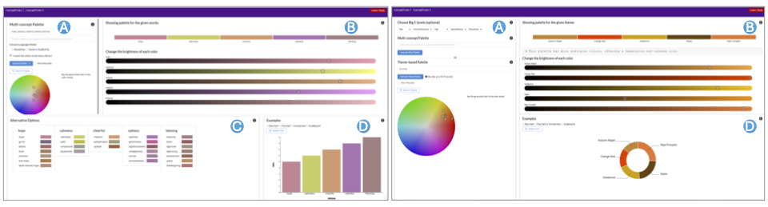

Concept2Color is an interactive tool that leverages language models to generate colors that are semantically resonant with user-provided concepts. The tool aims to enhance data visualization and human-computer interaction (HCI) by automatically suggesting color schemes that align with the meaning and context of the data being represented.

## Key Features
- **Language Model Integration**: Uses advanced language models to understand and interpret concept descriptions.
- **Semantic Color Generation**: Suggests colors based on the semantic associations with the provided concept.
- **Interactive Interface**: Allows users to fine-tune and explore different color suggestions in real time.
- **Data Visualization Examples**: Shows practical data visualization examples created dynamically using the generated colors.
- **Applications in Data Visualization**: Enhances the interpretability and aesthetics of visual analytics by choosing meaningful colors.

## Usage
1. **Input a Concept**: Provide a word or phrase representing the concept you want to visualize.
2. **Generate Colors**: The tool uses language models to suggest colors that resonate with the given concept.
3. **Fine-Tune the Palette**: Adjust and explore the suggested colors to match your desired look and feel.
4. **Export Colors**: Download the colors in your preferred format (e.g., HEX, RGB) for use in your projects.

## Technologies Used
- **Frontend**: D3.js for a dynamic and responsive user interface.
- **Backend**: Python and Flask for integrating the language model and color generation algorithms.
- **Machine Learning**: Word2Vec, GloVe, RoBERTa, GPT-4 language models for semantic interpretation.

## Demo
Coming soon.

<!-- ## License
Concept2Color is open-source under the MIT License. See the [LICENSE](#) file for more details. -->
